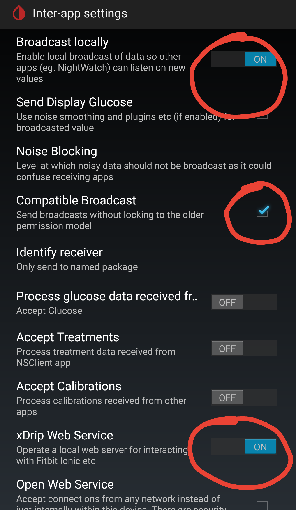
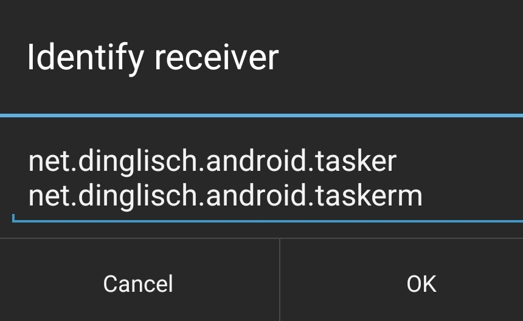

[Deutsche Version](README_DE.md)

GlucoseWatchfaces <!-- omit in toc -->
=================

- [Instruction](#instruction)
- [Prerequisites](#prerequisites)
- [Configuration](#configuration)
  - [Juggluco](#juggluco)
    - [Juggluco with xDrip+](#juggluco-with-xdrip)
    - [Juggluco with Juggluco Tasker Plugin](#juggluco-with-juggluco-tasker-plugin)
  - [xDrip+](#xdrip)
  - [Watchmaker](#watchmaker)
  - [Pujie](#pujie)


## Instruction

This is a documentation how to connect Glucose value receiving apps [Juggluco](https://play.google.com/store/apps/details?id=tk.glucodata) and [xDrip+](https://github.com/NightscoutFoundation/xDrip) to watchfaces of [Watchmaker](https://play.google.com/store/apps/details?id=slide.watchFrenzy) and [Pujie](https://play.google.com/store/apps/details?id=com.pujie.wristwear.pujieblack).

Here you can see my watchfaces for [Watchmaker](https://getwatchmaker.com/user/HkH1oOOtB) and [Pujie](images/Pujie_Black_Watchfaces.jpg).

If you like to use the [Watchmaker watchfaces from FreDiabetics](https://getwatchmaker.com/user/Bkd6tbYxr), you have to use this [manual](https://github.com/FreDiabetics/xDrip--Tasker-Tizen-Watchface-Integration).

## Prerequisites

* Install [Tasker](https://play.google.com/store/apps/details?id=net.dinglisch.android.taskerm)
* Install [Watchmaker](https://play.google.com/store/apps/details?id=slide.watchFrenzy) (+[premium licence](https://play.google.com/store/apps/details?id=slide.watchFrenzy.premium)) or [Pujie](https://play.google.com/store/apps/details?id=com.pujie.wristwear.pujieblack)
* Install [Juggluco](https://play.google.com/store/apps/details?id=tk.glucodata) (from [Juggluco website](http://jkaltes.byethost16.com/Juggluco/download.html)) or [xDrip+](https://github.com/NightscoutFoundation/xDrip)

## Configuration
### Juggluco
To send the data from Juggluco to Tasker, you have two options, either you are using xDrip+ or my [Juggluco Tasker Plugin](https://github.com/pachi81/JugglucoTaskerPlugin):
#### Juggluco with xDrip+
  * Open settings in Juggluco and activate "Send to xDrip"
  * Continue with the configuration of [xDrip+](#xdrip)

#### Juggluco with Juggluco Tasker Plugin
  * Open settings in Juggluco and activate "Glucodata broadcast"
  * Install latest release for [Juggluco Tasker Plugin](https://github.com/pachi81/JugglucoTaskerPlugin/releases)
  * Open Juggluco Tasker Plugin and deactivate battery optimization
  * Download Juggluco Tasker Profile for [Watchmaker](TaskerProfiles/Watchmaker/Glucodata_Broadcast_Watchmaker.prf.xml) or [Pujie](TaskerProfiles/Pujie/Glucodata_Broadcast_Pujie.prf.xml)
  * Go to the download location of the tasker profile and select </br>share the file with tasker
  * Check if the profile is enabled in tasker
  * Thats all, continue with [Watchmaker](#watchmaker) or [Pujie](#pujie)
### xDrip+

Go to xDrip+ setting and select Inter-app settings
   * Enable "Broadcast locally"
   * Enable "Compatible Broadcast"
   * Enable "xDrip Web Service" 
   * Set "Identify receiver" to:    
```
     net.dinglisch.android.tasker
     net.dinglisch.android.taskerm
```    
   * Download xDrip+ Tasker Profiles for [Watchmaker](TaskerProfiles/Watchmaker/xDrip_Broadcast_Watchmaker.prf.xml) or [Pujie](TaskerProfiles/Pujie/xDrip_Broadcast_Pujie.prf.xml)
   * Go to the download location of the tasker profile and select </br>share the file with tasker
   * Check if the profile is enabled in tasker
   * Thats all, continue with [Watchmaker](#watchmaker) or [Pujie](#pujie)
  
### Watchmaker
   * Open the app
   * Open the search field and type "pachi81"
   * Select a watchface and click on the send to watch button

### Pujie
   * Open the app and select "Watch face designer"
   * Open the "3 lines" menu and select Cloud library
   * Select "Catalog" in the bottom
   * Select "USERS" from the top
   * Search for "pachi81" (or for user "T1D Time Lord" who is also using my Tasker profiles)
   * Select a watchface and click on "TO WATCH"
   * you can also use "CUSTOMIZE" to download it to you local library where you can change it