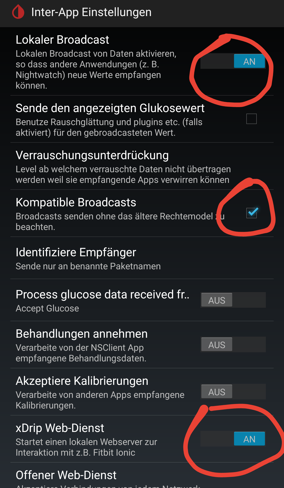
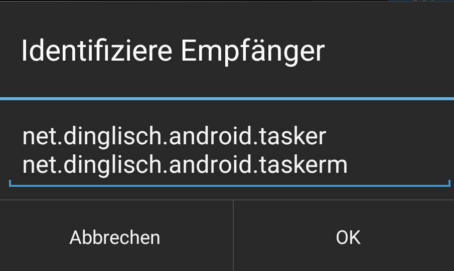

[English version](README.md)

GlucoseWatchfaces <!-- omit in toc -->
=================

- [Einleitung](#einleitung)
- [Voraussetzung](#voraussetzung)
- [Konfiguration](#konfiguration)
  - [Juggluco](#juggluco)
    - [Juggluco in Verbindung mit xDrip+](#juggluco-in-verbindung-mit-xdrip)
    - [Juggluco in Verbindung mit dem Juggluco Tasker Plugin](#juggluco-in-verbindung-mit-dem-juggluco-tasker-plugin)
  - [xDrip+](#xdrip)
  - [Watchmaker](#watchmaker)
  - [Pujie](#pujie)


## Einleitung

Diese Anleitung beschreibt die Verbindung der Apps [Juggluco](https://play.google.com/store/apps/details?id=tk.glucodata) und [xDrip+](https://github.com/NightscoutFoundation/xDrip) zu den Watchfaces für [Watchmaker](https://play.google.com/store/apps/details?id=slide.watchFrenzy) und [Pujie](https://play.google.com/store/apps/details?id=com.pujie.wristwear.pujieblack).

Hier sind meine derzeitigen Watchfaces für [Watchmaker](https://getwatchmaker.com/user/HkH1oOOtB) und [Pujie](images/Pujie_Black_Watchfaces.jpg) zu sehen.

Für Watchmake gibt es weitere Watchfaces von [FreDiabetics](https://getwatchmaker.com/user/Bkd6tbYxr), welche aber nicht mehr mit meinen Tasker Profilen funktionieren. Daher muss diese [Anleitung](https://github.com/FreDiabetics/xDrip--Tasker-Tizen-Watchface-Integration) von ihm verwendet werden.

## Voraussetzung

* [Tasker](https://play.google.com/store/apps/details?id=net.dinglisch.android.taskerm) installieren
* [Watchmaker](https://play.google.com/store/apps/details?id=slide.watchFrenzy) (+[Premium Lizenz](https://play.google.com/store/apps/details?id=slide.watchFrenzy.premium)) oder [Pujie](https://play.google.com/store/apps/details?id=com.pujie.wristwear.pujieblack) installieren
* [Juggluco](https://play.google.com/store/apps/details?id=tk.glucodata) (alternativ von der [Juggluco Seite](http://jkaltes.byethost16.com/Juggluco/download.html)) oder [xDrip+](https://github.com/NightscoutFoundation/xDrip) installieren

## Konfiguration
### Juggluco
Für die Verbindung von Juggluco mit Tasker gibt es zwei Möglichkeiten, entweder über xDrip+ oder über mein [Juggluco Tasker Plugin](https://github.com/pachi81/JugglucoTaskerPlugin):

#### Juggluco in Verbindung mit xDrip+
  * In den "settings" von Juggluco den Haken bei "Send to xDrip" setzen
  * Dann die Einstellungen für [xDrip+](#xdrip) vornehmen

#### Juggluco in Verbindung mit dem Juggluco Tasker Plugin
  * In den "settings" von Juggluco den Haken bei "Glucodata broadcast" setzen
  * Das letzte Release von meinem [Juggluco Tasker Plugin](https://github.com/pachi81/JugglucoTaskerPlugin/releases) installieren
  * Die App "Juggluco Tasker Plugin" starten und die Batterie Optimierung deaktiveren
  * Das Juggluco Tasker Profile für [Watchmaker](TaskerProfiles/Watchmaker/Glucodata_Broadcast_Watchmaker.prf.xml?raw=1) oder [Pujie](TaskerProfiles/Pujie/Glucodata_Broadcast_Pujie.prf.xml?raw=1) herunterladen (entweder lange drücken oder rechte Maustaste und Speichern unter... auswählen)
  * Entweder direkt _öffnen mit_ auswählen und Tasker als Ziel wählen<br/> oder Tasker öffnen und auf dem PROFILE Tab lange drücken und _Importiere ein Profil_ auswählen
  * In Tasker prüfen, ob das Profil aktiviert ist
  * Das wars, weiter geht es mit den Watchfaces für [Watchmaker](#watchmaker) oder [Pujie](#pujie)

### xDrip+
In den xDrip+ Einstellung den Eintrag Inter-App Einstellungen öffnen und wie folgt konfigurieren:
   * "Lokaler Broadcast" aktivieren
   * "Kompatible Broadcast" aktivieren
   * "xDrip Web-Dienst" aktivieren 



   * Beim Punkt "Identifiziere Empfänger" folgendes eintragen: 
    


```
net.dinglisch.android.tasker
net.dinglisch.android.taskerm
```    
   * Das xDrip Tasker Profile für [Watchmaker](TaskerProfiles/Watchmaker/xDrip_Broadcast_Watchmaker.prf.xml?raw=1) oder [Pujie](TaskerProfiles/Pujie/xDrip_Broadcast_Pujie.prf.xml?raw=1) herunterladen (entweder lange drücken oder rechte Maustaste und Speichern unter... auswählen)
   * Entweder direkt _öffnen mit_ auswählen und Tasker als Ziel wählen<br/> oder Tasker öffnen und auf dem PROFILE Tab lange drücken und _Importiere ein Profil_ auswählen
   * In Tasker prüfen, ob das Profil aktiviert ist
   * Das wars, weiter geht es mit den Watchfaces für [Watchmaker](#watchmaker) oder [Pujie](#pujie)
  
### Watchmaker
   * Die App öffnen
   * Die Lupe oben rechts anklicken und "pachi81" eingeben
   * Eins meiner Watchfaces auswählen und den Button zum Senden an die Uhr drücken

### Pujie
   * Die App öffnen und "Watch face designer" auswählen
   * Das "3 Linien" Menu drücke und Cloud library auswählen
   * Unten auf "Catalog" drücken
   * Oben ganz rechts "USERS" auswählen
   * Nach "pachi81" suchen (alternativ bietet der User "T1D Time Lord" auch Watchfaces an, welche mit meinen Tasker Profilen funktionieren)
   * Ein Watchface auswählen auf auf "TO WATCH" drücken
   * Alternativ können sie auch "CUSTOMIZE" drücken, um das Watchface in die "Local library" herunterzuladen. Dort können sie es nach belieben anpassen
